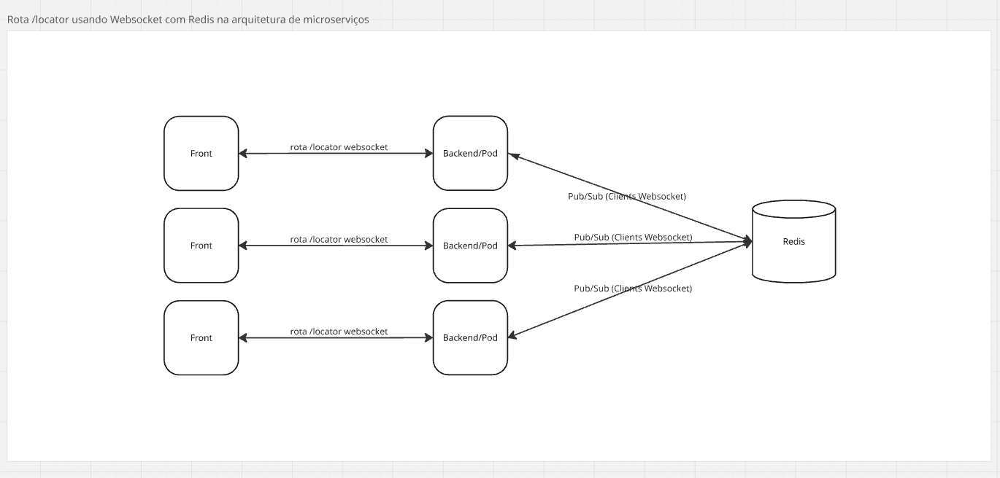

# Funcionalidade de Localização

O endpoint /locator disponibiliza informações das coordenadas dos usuários pertencentes a um grupo pré definido, para que o Client(Web, Mobile) utilize as informações no mapa de localização.

Nesse endpoint é realizado a técnica de polling para se obter dados da localização em um curto espaço de tempo gerando alguns problemas de infraestrutura e experiência do usuário.

Com base nisso pretendemos utilizar WebSockets em vez de HTTP, para ter uma comunicação mais eficiente e em tempo real.

Devido à arquitetura de microserviços, outra tecnologia que se faz necessária é o Redis. Com ele, todos os serviços conseguem ter acesso à informação de todos os Clients(web e mobile) que estão conectados ao websocket.

O HTTP é um protocolo sem estado, onde cada requisição é uma nova conexão. No cenário de polling, o cliente envia requisições repetidas para o servidor para verificar se há novas informações. Isso gera um tráfego de rede considerável, com cabeçalhos de requisição e resposta sendo enviados em cada interação, mesmo quando não há dados novos. Esse método é ineficiente e pode levar a latência, pois o cliente só recebe as atualizações no intervalo de polling.

Já o WebSocket é um protocolo que estabelece uma única conexão persistente e bidirecional entre o cliente e o servidor. Após o "handshake" inicial, a conexão permanece aberta e ambos os lados podem enviar dados a qualquer momento, sem a necessidade de reabrir a conexão.

O NestJS simplifica a implementação de WebSockets, pois sua abstração permite que seja utilizado sem a necessidade de manter um servidor adicional, economizando recursos e eliminando a complexidade de gerenciar portas extras.

## Vantagens do WebSocket

- Redução de Latência: Com a conexão persistente, o servidor pode enviar atualizações para o cliente instantaneamente, assim que os dados estiverem disponíveis. Isso elimina a latência associada ao intervalo de polling, garantindo que o cliente sempre tenha a informação mais atualizada no menor tempo possível.

- Eficiência de Rede: Ao eliminar as requisições e respostas repetidas do polling, os WebSockets reduzem drasticamente o tráfego de rede. Em vez de enviar cabeçalhos completos em cada interação, os dados são transmitidos em "frames" leves, o que resulta em um uso mais eficiente da largura de banda e menos sobrecarga no servidor.

- Melhora da Experiência do Usuário: Para uma aplicação que depende de dados em tempo real, como um localizador, a atualização instantânea proporcionada pelos WebSockets resulta em uma experiência de usuário mais fluida e responsiva, sem a percepção de atrasos ou "pulos" na informação.

Em resumo, enquanto o HTTP com polling pode "funcionar", o WebSocket é a escolha técnica superior para esta funcionalidade. Ele otimiza a performance, reduz a latência e o consumo de recursos, além de ser a arquitetura padrão para aplicações que demandam comunicação em tempo real e atualizações constantes.

